### KV Simple Replication - In Memo Database (KV stands for Key Value)

#### Assignee: nick.christidis@yahoo.com / cs1200005@di.uoa.gr


### Description


The `kv-infra` consists from the following modules:
* [data-injector](data-injector/README.md) which is responsible for producing the data which will be inserted to
  the `kv-server`.
  

  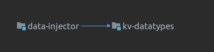

<hr/>
    
* [kv-broker](kv-broker/README.md) is responsible for communicating with the `kv-server` and performing the supported actions
  (get, put, delete, query). A client application, will have as dependency the `kv-broker` to interact with our `kv-server`.

  Both `kv-server` and `kv-broker` has been written with socket-programming(`java.nio.channels`) as infra (event loop - non blocking fashion).

  `kv-broker` has been developed as a library artifact ([KvBrokerApi.java](kv-broker/src/main/java/chriniko/kv/broker/KvBrokerApi.java)) 
  rather than a command line program which will receive input from the user as described in the assignment documentation.

  So, a third party program (client) if wants to use the `kv-server` should have `kv-broker` as a dependency, run one or more `kv-server`
  and start the `kv-broker` (inside client program because it has been used as a dependency) pointing to the running `kv-server(s)`.
  

  Moreover, it provides 4 consistency levels for executing the supported operations, these are the following:
    * ONE
    * ALL
    * QUORUM ((sum_of_replication_factors / 2) + 1)
    * REPLICATION FACTOR
  More can be checked at: [ConsistencyLevel.java](kv-broker/src/main/java/chriniko/kv/broker/ConsistencyLevel.java)

  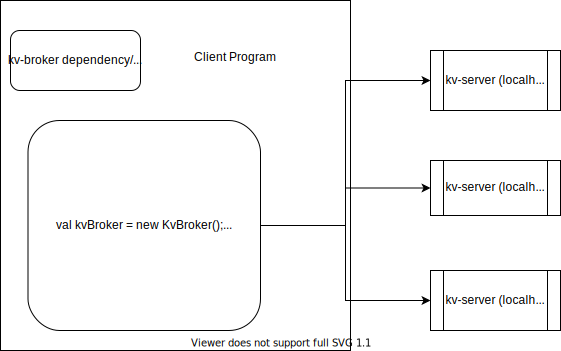
  <br/>

  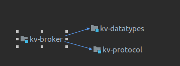
  <br/>

  * Supported operations / tests to check (these tests are integration, meaning that they run 3 kv-servers, with one kv-broker in order to fire commands):
    * Get -> [KvBrokerGetOperationTest.java](kv-broker/src/test/java/chriniko/kv/broker/KvBrokerGetOperationTest.java)
    * Put -> [KvBrokerPutOperationTest.java](kv-broker/src/test/java/chriniko/kv/broker/KvBrokerPutOperationTest.java)
    * Delete -> [KvBrokerDeleteOperationTest.java](kv-broker/src/test/java/chriniko/kv/broker/KvBrokerDeleteOperationTest.java)
    * Query -> [KvBrokerQueryOperationTest.java](kv-broker/src/test/java/chriniko/kv/broker/KvBrokerQueryOperationTest.java)


<hr/>

* [kv-datatypes](kv-datatypes/README.md) the definition of supported values which `kv-server` can understand during deserialization of received string.
    * Flat values ([FlatValue.java](kv-datatypes/src/main/java/chriniko/kv/datatypes/FlatValue.java)) such as:
      * [StringValue](kv-datatypes/src/main/java/chriniko/kv/datatypes/StringValue.java)
      * [FloatValue](kv-datatypes/src/main/java/chriniko/kv/datatypes/StringValue.java)
      * [EmptyValue](kv-datatypes/src/main/java/chriniko/kv/datatypes/StringValue.java)
      * [IntValue](kv-datatypes/src/main/java/chriniko/kv/datatypes/StringValue.java)
    * Nested value: [NestedValue.java](kv-datatypes/src/main/java/chriniko/kv/datatypes/NestedValue.java)
    * List value: [ListValue.java](kv-datatypes/src/main/java/chriniko/kv/datatypes/ListValue.java)
    

  
  For this, at first a custom parser has been created to support the initial specification for the datatypes as explained in the
  assignment documentation, so the following code infra has been created: [DatatypesParser.java](kv-datatypes/src/main/java/chriniko/kv/datatypes/parser/DatatypesParser.java)
  which testing it I have seen that the complexity has risen dramatically (not maintainable code and in the future if we want
  a future request things will be hard).
  
  So for this reason, I pulled ANTLR4 (https://www.antlr.org/) to the game in
  order to make it extensible/more robust for the future (my motivation is to continue working on this KV after the class also)
    
  So I defined with changing a little the grammar/definition for the datatypes, where someone can see it here: [KvDatatypes.g4](kv-datatypes/src/main/antlr4/chriniko/kv/datatypes/KvDatatypes.g4)
  and by executing `mvn org.antlr:antlr4-maven-plugin:antlr4 -pl kv-datatypes/`
  `KvDatatypesLexer`, `KvDatatypesParser` and `KvDatatypesBaseListener` has been generated:
  
  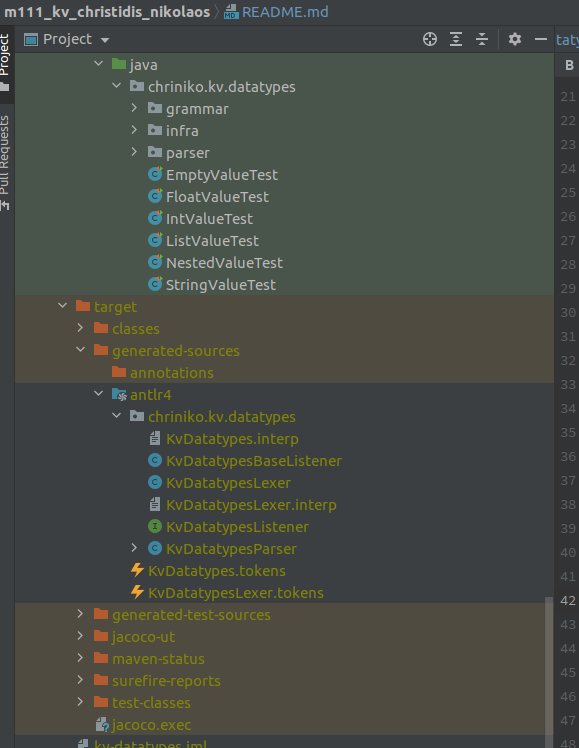
  
  where I have extended the `KvDatatypesBaseListener` with [KvDatatypesAssemblyListener.java](kv-datatypes/src/main/java/chriniko/kv/datatypes/grammar/KvDatatypesAssemblyListener.java) in order to write the parsing logic,
  `f: (String) => Value<?>`
  so now we have an extensible grammar for future use.

  So we can understand that we can support very complex data representations, such as:
  * ```text
        { "_myList" : [ { "_fn3" : { "_nf4" : { "_float23" : 2.34 } } } ; { "_strTemp" : "allGood allFine all work" } ; { "_fn32" : { "_nf42" : { "_someOtherStr" : "someOtherStrValue" } } } ] }
    ```

  * ```text
        { "_studentDetails" : [ { "_username" : "chriniko" } ; { "_email" : "chriniko" } ; { "_address" : [ { "_street" : "Panepistimioupoli 123, Kesariani" } ; { "_postCode" : "16121" } ; { "_city" : "Athens" } ; { "_country" : "Greece" } ] } ; { "_name" : [ { "_firstname" : "Nikolaos" } ; { "_surname" : "Christidis" } ] } ] }
    ```

  * ```text
          { "_n1" : { "_someList" : [ { "_fn3" : { "_nf4" : { "_strTemp" : "allGood" } } } ; { "_n2" : { "_int2" : 2 } } ; { "_p3" : { "_n3List" : [ { "_gn3" : { "_gn4" : { "_gstrTemp" : "allGood" } } } ; { "_gf1" : { "_gf2" : { "_gf3" : { "_gf4" : { "_gfString" : "gfValue" } } } } } ] } } ; { "_n5" : { "_float2" : 2.34 } } ; { "_n71" : { "_n72" : { "_listGh" : [ { "_n3" : { "_n4" : { "_strTemp2" : "allGood" } } } ; { "_f1" : { "_f2" : { "_f3" : { "_f4" : { "_fString" : "fValue" } } } } } ] } } } ] } }
    ```

  To get a better idea of the supported types, you can check: [DatatypesAntlrParserComplexTest.java](kv-datatypes/src/test/java/chriniko/kv/datatypes/parser/antlr/DatatypesAntlrParserComplexTest.java)

  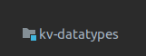


<hr/>
  
* [kv-server](kv-server/README.md) is responsible for receiving the request from `kv-broker`, parsing it, executing
  the required logic, access if necessary the storage engine and reply-back to `kv-broker` with the correct response.
  Both `kv-server` and `kv-broker` has been written with socket-programming(`java.nio.channels`) as infra (event loop - non blocking fashion).

  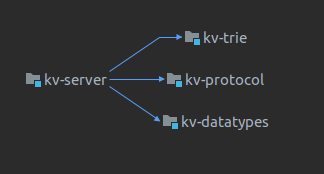

  * Indexing process:
        For supporting query operation, I have implemented `KvRecord#indexContents()` method --> [KvRecord#indexContents.java](kv-server/src/main/java/chriniko/kv/server/infra/KvRecord.java)
        by using ANTLR4 defined grammar in `kv-datatypes`.
        So, I have created a listener [KvDatatypesIndexingListener.java](kv-server/src/main/java/chriniko/kv/server/index/KvDatatypesIndexingListener.java) which process the input string
        and returns a `LinkedHashMap<String, Value<?>>` which for each entry the key contains the key path and for the value the indexed record.
        <br/>
        <br/>
        The indexing process takes place during insert of the record (pre-calculation) which also can happen in an asynchronous manner for leveraging the hardware.
        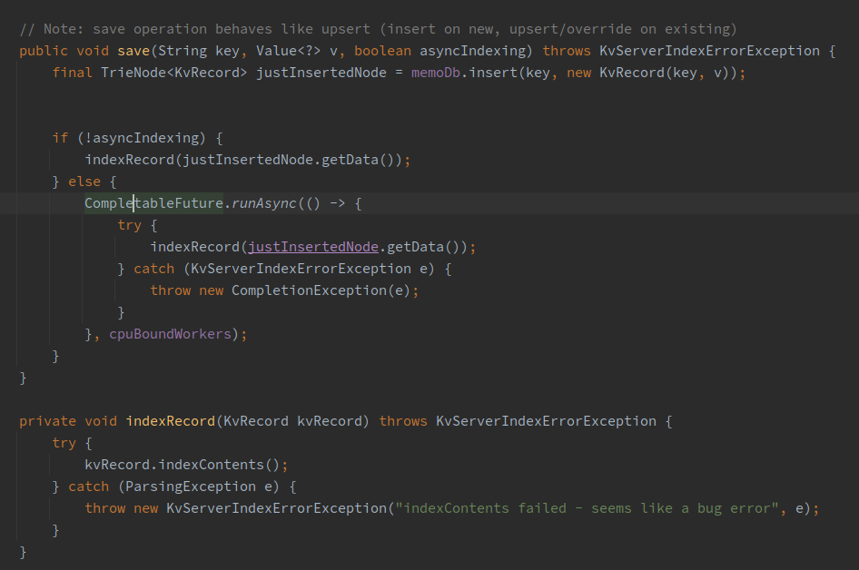
        <br/>
        <br/>
    * Example:
      
      Input string: `"_chriniko1711" : { "_studentDetails" : [ { "_username" : "chriniko" } ; { "_email" : "chriniko" } ; { "_address" : [ { "_street" : "Panepistimioupoli 123, Kesariani" } ; { "_postCode" : "16121" } ; { "_city" : "Athens" } ; { "_country" : "Greece" } ] } ; { "_name" : [ { "_firstname" : "Nikolaos" } ; { "_surname" : "Christidis" } ] } ] }`
      
      Output after indexing:
      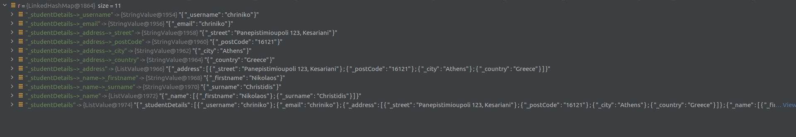
      <br/>
      <br/>
      So we can understand that the query operation has O(n) time complexity (where n is the length of the key) in order to find the record (eg: from above string `_chriniko1711`), and then is O(1)
      in order to access-find the value of the record based on provided key path(query key) which is indexed (eg: from above string `_studentDetails~>_username`)
      <br/>
      `value <- query('_chriniko1711', '_studentDetails~>_username');`
      <br/>
      <br/>
      In order to satisfy the exercise, the indexing of record does not only get supported from the above explained map, but also with an inner trie per record level.
      (Check to see how inner trie per record level is constructed: [KvRecord#indexContents.java](kv-server/src/main/java/chriniko/kv/server/infra/KvRecord.java))
      <br/>
      <br/>
      [KvStorageEngine#query.java](kv-server/src/main/java/chriniko/kv/server/infra/KvStorageEngine.java) takes as parameter if during query search to use trie or map.
      <br/>
      <br/>
      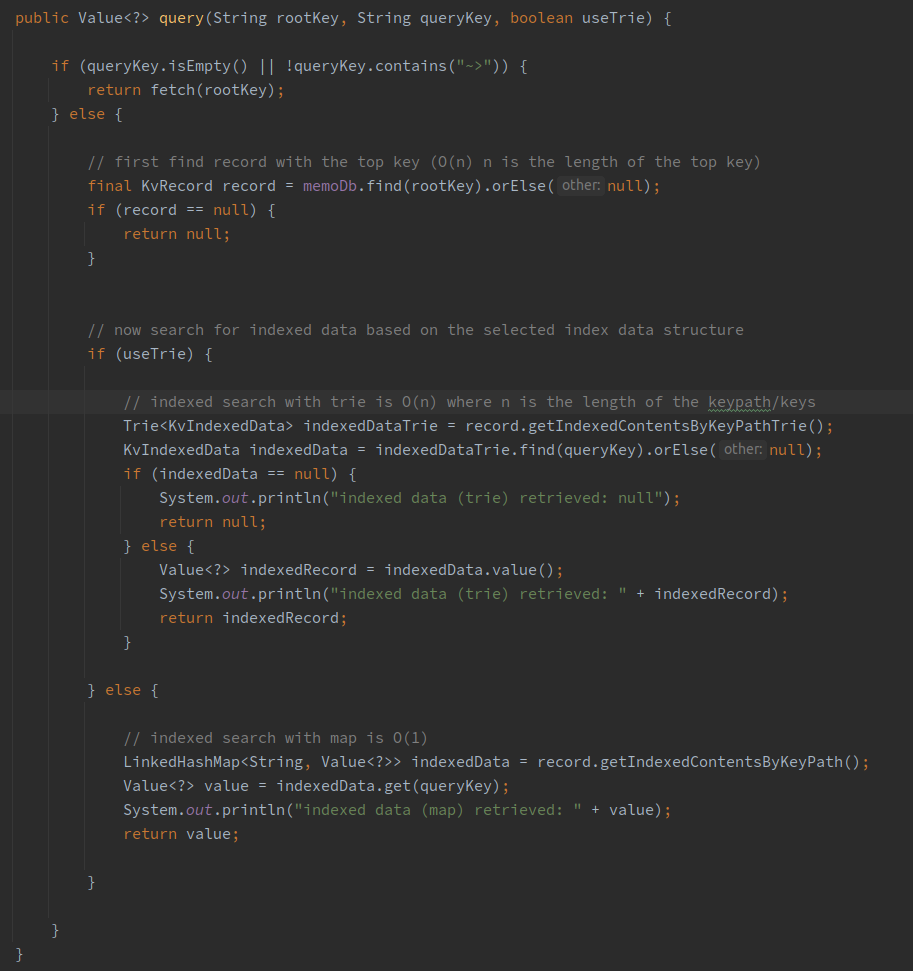
      <br/>
      <br/>
      Of course, by using the inner trie in order to query-search the provided key path of the target record the time complexity is O(n) where n is the length of the keypath.


<hr/>
    
* [kv-trie](kv-trie/README.md) contains infra code to support the Trie data structure. The [Trie.java](kv-trie/src/main/java/chriniko/kv/trie/Trie.java)
  is a no thread safe implementation.

  

    * [Trie.java](kv-trie/src/main/java/chriniko/kv/trie/Trie.java) is a no thread safe implementation
    
    * [TrieLS.java](kv-trie/src/main/java/chriniko/kv/trie/lock_stripping/TrieLS.java) is a thread safe implementation by using lock stripping:
        ```text
            Brian Goetz - Java Concurrency in Practise - 11.4.3. Lock Striping
      
      
            Splitting a heavily contended lock into two is likely to result in two heavily contended locks. While this will produce a
            small scalability improvement by enabling two threads to execute concurrently instead of one, it still does not
      
            dramatically improve prospects for concurrency on a system with many processors. The lock splitting example in the
            ServerStatus classes does not offer any obvious opportunity for splitting the locks further.
            Lock splitting can sometimes be extended to partition locking on a variablesized set of independent objects, in which
            case it is called lock striping. For example, the implementation of ConcurrentHashMap uses an array of 16 locks, each of
            which guards 1/16 of the hash buckets; bucket N is guarded by lock N mod 16. Assuming the hash function provides
            reasonable spreading characteristics and keys are accessed uniformly, this should reduce the demand for any given lock
            by approximately a factor of 16. It is this technique that enables ConcurrentHashMap to support up to 16 concurrent
            writers. (The number of locks could be increased to provide even better concurrency under heavy access on highͲ
            processorͲcount systems, but the number of stripes should be increased beyond the default of 16 only when you have
            evidence that concurrent writers are generating enough contention to warrant raising the limit.)
            One of the downsides of lock striping is that locking the collection for exclusive access is more difficult and costly than
            with a single lock. Usually an operation can be performed by acquiring at most one lock, but occasionally you need to
            lock the entire collection, as when ConcurrentHashMap needs to expand the map and rehash the values into a larger set
            of buckets. This is typically done by acquiring all of the locks in the stripe set.
        ```

<hr/>

* [kv-protocol](kv-protocol/README.md) contains common code which is used for the communication between `kv-server` and `kv-broker`.

  


<hr/>

* [sample-app](sample-app/README.md) due to the nature of `kv-broker` which has been developed to be an artifact (api library) and not
a CLI, this module is a simple app which makes use of the `kv-broker` library to interact with the `kv-server`.

### Run all tests
* For running all tests execute: `mvn clean test`.

* For running tests of a selected module, execute for example: `mvn clean test -pl  kv-datatypes/`


### How to generate the code from ANTLR4 (lexer, parser, listener, etc)
* Execute: `mvn org.antlr:antlr4-maven-plugin:antlr4 -pl kv-datatypes/`


### Build everything
* Just execute: `mvn clean install`

* Sample output after build success:
    ```text
        [INFO] ------------------------------------------------------------------------
        [INFO] Reactor Summary for m111_kv_christidis_nikolaos 1.0-SNAPSHOT:
        [INFO]
        [INFO] m111_kv_christidis_nikolaos ........................ SUCCESS [  0.280 s]
        [INFO] kv-datatypes ....................................... SUCCESS [  7.232 s]
        [INFO] data-injector ...................................... SUCCESS [ 11.476 s]
        [INFO] kv-protocol ........................................ SUCCESS [  0.309 s]
        [INFO] kv-trie ............................................ SUCCESS [  3.541 s]
        [INFO] kv-server .......................................... SUCCESS [  7.705 s]
        [INFO] kv-broker .......................................... SUCCESS [ 11.080 s]
        [INFO] ------------------------------------------------------------------------
        [INFO] BUILD SUCCESS
        [INFO] ------------------------------------------------------------------------
        [INFO] Total time:  41.771 s
        [INFO] Finished at: 2021-04-16T20:49:34+03:00
        [INFO] ------------------------------------------------------------------------

    ```


### How to run ?

* First run eg: 3 `kv-servers` for more info on how to do it check --> [kv-server](kv-server/README.md)
    * eg:
        * `java -jar kv-server/target/kv-server-1.0-SNAPSHOT-jar-with-dependencies.jar 127.0.0.1 8081 18081`
        * `java -jar kv-server/target/kv-server-1.0-SNAPSHOT-jar-with-dependencies.jar 127.0.0.1 8082 18082`
        * `java -jar kv-server/target/kv-server-1.0-SNAPSHOT-jar-with-dependencies.jar 127.0.0.1 8083 18083`

    * Example screen:
        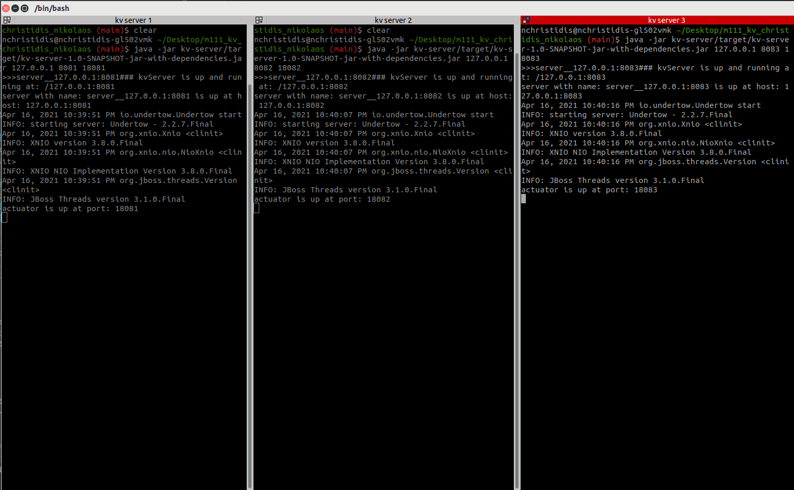
      


* Then you can run the `kv-broker` by providing the necessary input args, for more info check --> [kv-broker](kv-broker/README.md)
    * eg:
        * `java -jar kv-broker/target/kv-broker-1.0-SNAPSHOT-jar-with-dependencies.jar ~/Desktop/m111_kv_christidis_nikolaos/kv-broker/sampleServerFile.txt ~/Desktop/m111_kv_christidis_nikolaos/kv-broker/sampleData.txt 3`
    
    * Example screen:
        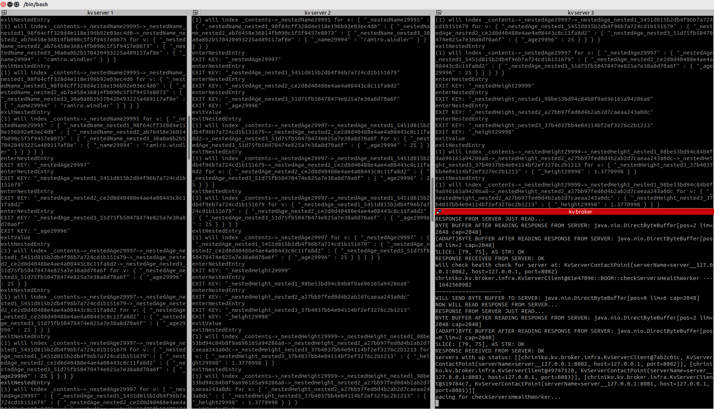


* In order to check the index if was successful for each `kv-server` you can check the actuator of each one:
    * `http://localhost:18081/`
    * `http://localhost:18082/`
    * `http://localhost:18083/`

    * Images:
        * 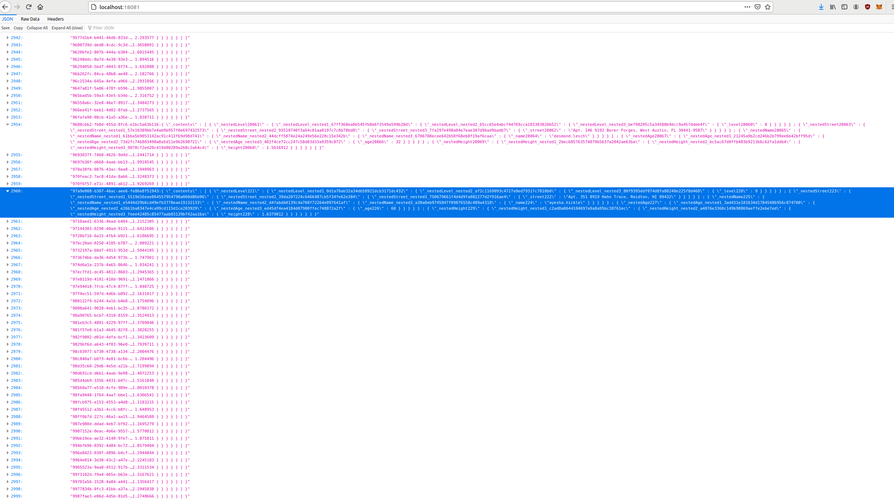
        * 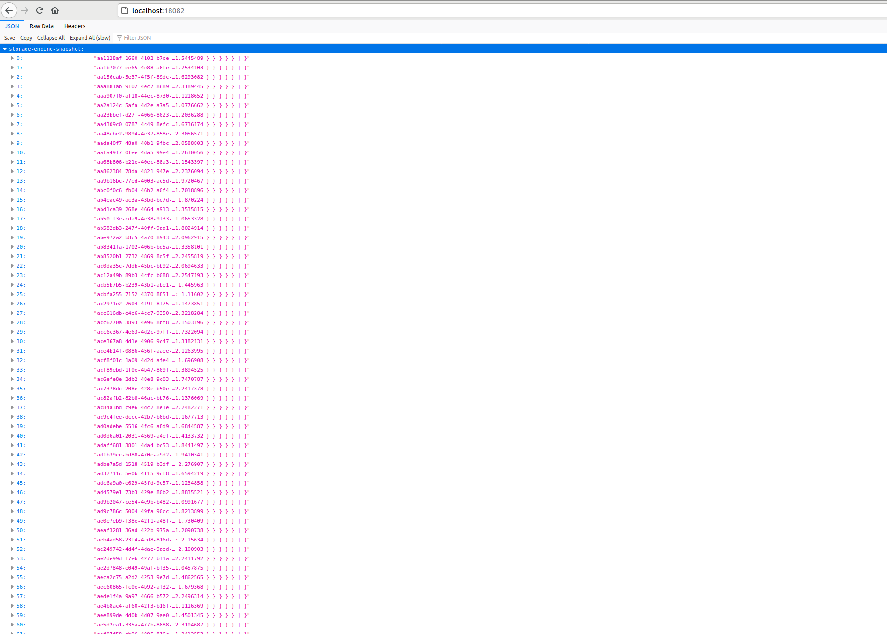
        * 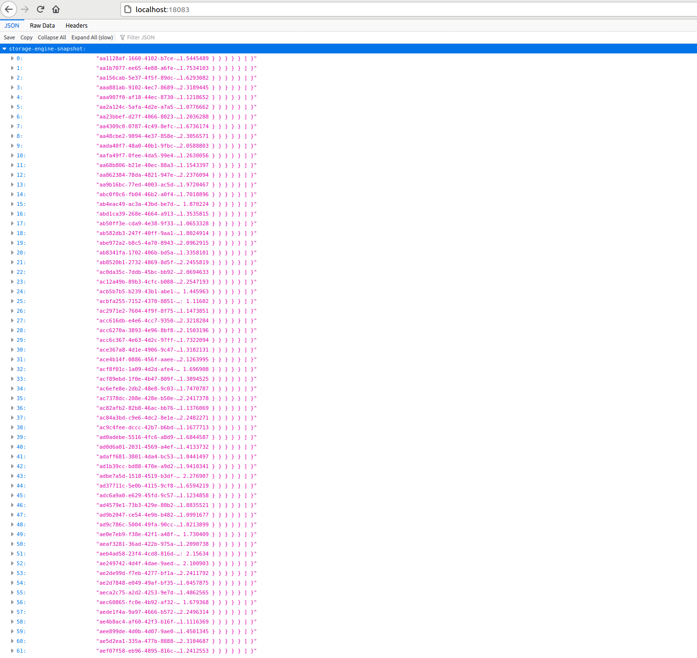


* Now, you can run the [sample-app](sample-app/README.md) which is doing a short demonstration of `kv-broker` library.
    * eg: ` java -jar sample-app/target/sample-app-1.0-SNAPSHOT-jar-with-dependencies.jar localhost 8081 8082 8083`

<hr/>

### Useful tutorials
* Good info about ByteBuffers ==> `https://www.javacodegeeks.com/2012/12/the-java-bytebuffer-a-crash-course.html`

* `https://www.waitingforcode.com/java-i-o/handling-multiple-io-one-thread-nio-selector/read`

* [Antlr4 Personal Notes](kv-datatypes/antlr4_notes)