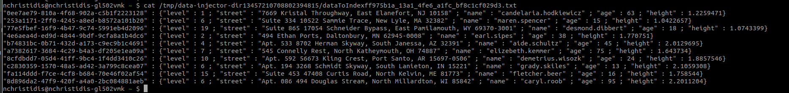

### Data Injector

#### Description


The goal of the program is to randomly generate as much data as was specified by the `-n` parameter, up
to the given length ( -l ) of strings, up to (-m) keys per nesting level and up to the given nesting level
( -d ). Do not worry if the data do not make sense (e.g. age contains an address). This task is meant for
you to create datasets that you can use to develop the remaining of the project. 
You can use random key names and types for the keyFile.txt if you like and you can create your own keyFile.txt. 

For only the top-level keys you can either generate random strings or you can generate keys of the form key1,
key2, key3, etc. for easier debugging.


#### How to run tests
* `mvn clean test`

#### How to build and run jar
* `mvn clean install` (on the root module: `m111_kv_nikolaos_christidis`)
    * Sample output:
    ```text
      nchristidis@nchristidis-gl502vmk ~/Desktop/m111_kv_christidis_nikolaos (main)$ mvn clean install
      [INFO] Scanning for projects...
      [INFO] ------------------------------------------------------------------------
      [INFO] Reactor Build Order:
      [INFO]
      [INFO] m111_kv_christidis_nikolaos                                        [pom]
      [INFO] data-injector                                                      [jar]
      [INFO] kv-broker                                                          [jar]
      [INFO] kv-server                                                          [jar]
      [INFO] kv-storage                                                         [jar]
      [INFO]
      [INFO] --------------< org.example:m111_kv_christidis_nikolaos >---------------
      [INFO] Building m111_kv_christidis_nikolaos 1.0-SNAPSHOT                  [1/5]
      [INFO] --------------------------------[ pom ]---------------------------------
      [INFO]
  
      .....

      [INFO] Reactor Summary for m111_kv_christidis_nikolaos 1.0-SNAPSHOT:
      [INFO]
      [INFO] m111_kv_christidis_nikolaos ........................ SUCCESS [  0.262 s]
      [INFO] data-injector ...................................... SUCCESS [  4.830 s]
      [INFO] kv-broker .......................................... SUCCESS [  0.067 s]
      [INFO] kv-server .......................................... SUCCESS [  0.058 s]
      [INFO] kv-storage ......................................... SUCCESS [  0.028 s]
      [INFO] ------------------------------------------------------------------------
      [INFO] BUILD SUCCESS
      [INFO] ------------------------------------------------------------------------
      [INFO] Total time:  5.348 s
      [INFO] Finished at: 2021-03-14T11:56:24+02:00
      [INFO] ------------------------------------------------------------------------
    ```

* So now execute the jar with your selected input parameters, eg: ``
  * Sample output:
  ```text
    nchristidis@nchristidis-gl502vmk ~/Desktop/m111_kv_christidis_nikolaos (main)$ java -jar data-injector/target/data-injector-1.0-SNAPSHOT-jar-with-dependencies.jar 10 1 10 50
    data generator finished successfully, check generated file at: /tmp/data-injector-dir13457210708802394815/dataToIndexff975b1a_13a1_4fe6_a1fc_bf8c1cf029d3.txt

  ```
  
  * 
  
  * Contents of the generated file:
    ```text
    
        "0ee7ae79-810a-4f68-902a-c5b1f2223128" : {"level" : 1 ; "street" : "7669 Kristal Throughway, East Elanefort, NJ 10158" ; "name" : "candelaria.hodkiewicz" ; "age" : 63 ; "height" : 1.2259471}
        "253a1171-2ff0-4245-a8ed-b8572a101b20" : {"level" : 6 ; "street" : "Suite 334 10522 Sammie Trace, New Lyle, MA 32382" ; "name" : "maren.spencer" ; "age" : 15 ; "height" : 1.0422657}
        "77e5fbef-16f9-4b47-9c74-5991eb4d2096" : {"level" : 19 ; "street" : "Suite 865 17054 Schneider Bypass, East Pamilamouth, WY 69370-3001" ; "name" : "desmond.dibbert" ; "age" : 18 ; "height" : 1.0743399}
        "4e6aea4d-ed9d-4844-9bdf-9cfa8a1b4dc6" : {"level" : 2 ; "street" : "494 Ethan Ports, Daltonbury, MN 62945-0008" ; "name" : "earl.sipes" ; "age" : 38 ; "height" : 1.770751}
        "b74831bc-0b71-432d-a173-c9ec9b1c4691" : {"level" : 4 ; "street" : "Apt. 533 8702 Herman Skyway, South Janessa, AZ 32391" ; "name" : "aide.schultz" ; "age" : 45 ; "height" : 2.0129695}
        "a7382617-3684-4c29-b4a3-df205e1ea09a" : {"level" : 7 ; "street" : "545 Connelly Rest, North Katheymouth, OH 74887" ; "name" : "elizebeth.kemmer" ; "age" : 75 ; "height" : 1.643734}
        "8cfdbdd7-05d4-41ff-9bc4-1f4dd3410c26" : {"level" : 10 ; "street" : "Apt. 592 56673 Kling Crest, Port Santo, AR 15697-0506" ; "name" : "demetrius.wisozk" ; "age" : 24 ; "height" : 1.8857546}
        "c2830359-1570-48a5-ad42-3a799c8cea07" : {"level" : 6 ; "street" : "Apt. 194 3268 Schmidt Skyway, South Lanieton, IN 15221" ; "name" : "grady.skiles" ; "age" : 13 ; "height" : 2.1059308}
        "fa114ddd-f7ce-4cf8-b684-70e46f02af54" : {"level" : 15 ; "street" : "Suite 453 47408 Curtis Road, North Kelvin, ME 81773" ; "name" : "fletcher.beer" ; "age" : 16 ; "height" : 1.758544}
        "8d896da2-47f9-420f-a4a0-2bc084881aeb" : {"level" : 6 ; "street" : "Apt. 086 494 Douglas Stream, North Millardton, WI 85842" ; "name" : "caryl.roob" ; "age" : 95 ; "height" : 2.2011204}

    ```
  

